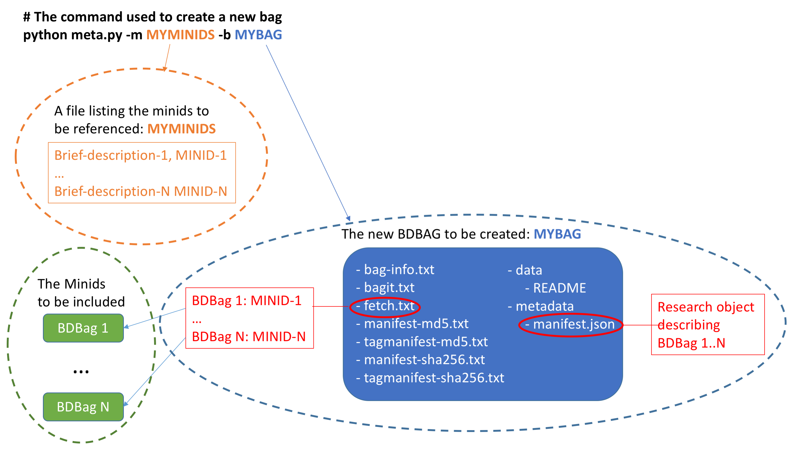

# bdbag examples

#### BDDS Big Data Bag Examples

We provide here what we hope will become a set of examples 
(so far, just one) to illustrate the use the **bdbag** utilities for various purposes.
Some of these examples might eventually become additional utilities, but for now 
they are provided as is, with no commitments as to quality or support. That said,
pleae do notify us of any problems, comments, or suggestions by filing an issue.

### Dependencies

* [Python 2.7](https://www.python.org/downloads/release/python-2711/) is the minimum Python version required.
* The code and dependencies are currently compatible with Python 3.

### The `meta.py` example

This program creates a new big data bag (BDBag) containing a supplied set of (descriptive string, Minid) pairs,
each of which is assumed to reference a single BDBag.  That is, a "meta-bag." This BDBag contains:
* A `data/README` file providing some description, and listing the files referenced by the Minids
* A `metadata/manifest.json` with a Research Object describing the BDBag's contents
* A `fetch.txt` file with the info required to fetch the sub-bags into "data" (standard BDBag stuff)

```sh
python meta.py -m MINIDS -b BAGNAME [-r REMOTE_FILE_MANIFEST] [-V] [-h]
```
* `MINIDS` : Name of the input file that lists the minids to be integrated. Each line is a comma-separated <descriptive string>, <minid> pair
* `BAGNAME` : Name of the directory that is to be created for the new BDBag
* `REMOTE_FILE_MANIFEST` : Name of the temporary file in which to place the remote file manifest before passing it to the **bdbag** command. By default, "t.json" is used.
* `-V` : If provided, then once bag is created, fetch bag contents and validate it.

In the following image, we show a request to create a new BDBag, `MYBAG`, that is to contain
the bags listed in the file `MYMINIDS`. The new BDBag contains the usual files that are to be
found in a BDBag, with the `fetch.txt` file containing the Minids that can be used to fetch
their contents and the `data/manifest.json` containing descriptive metadata. The `data/README` file
contains helpful background information.



Many limitations
* Essentially no error checking.
* manifest.json is a Research Object, but does not include provenance info
`
